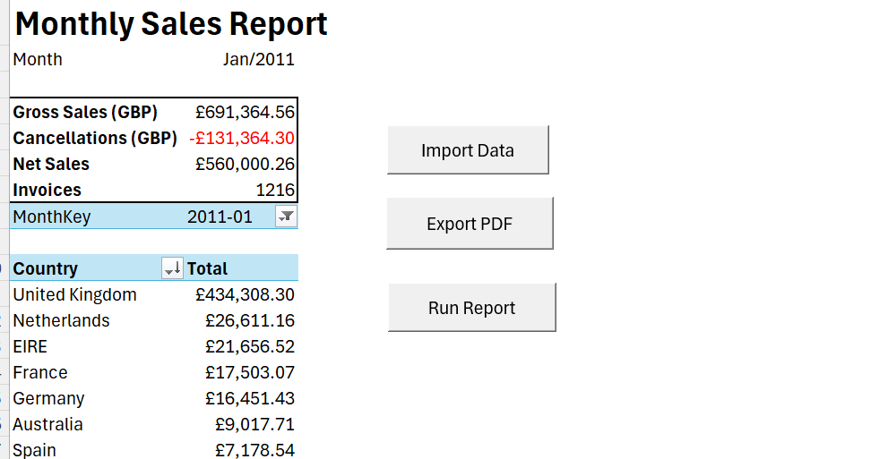
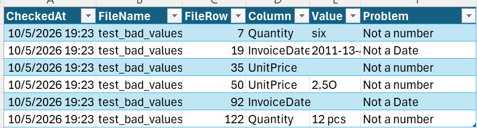
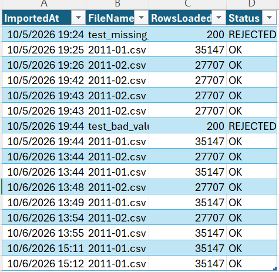

# Monthly Sales Report Automation (Excel VBA)

A one-click monthly sales report for a UK online retailer. A sales manager clicks **Run Report**, picks the month's transaction file, and gets a validated, refreshed PDF report in about 5 seconds. The same process takes about 14 minutes by hand.



## The business problem

Each month, someone has to take the raw invoice-line export, load it into Excel, recalculate sales, check for bad data, update the country breakdown, and send a PDF to management. Done by hand, this is slow and easy to get wrong:

- **Stale numbers.** Forgetting to refresh the PivotTable sends last month's figures under this month's name.
- **Double counting.** Pasting a file twice inflates the totals.
- **Bad data.** Text in a quantity column or an invalid date quietly breaks the formulas.

This workbook automates the workflow and guards against all three.

## Dataset

[UCI Online Retail](https://archive.ics.uci.edu/dataset/352/online+retail) contains 541,909 invoice lines from a UK-based online gift retailer, covering December 2010 to December 2011 (Chen, D., 2015, UCI Machine Learning Repository, [doi:10.24432/C5BW33](https://doi.org/10.24432/C5BW33), CC BY 4.0).

| Column | Meaning |
|---|---|
| `InvoiceNo` | Invoice number. A **`C` prefix marks a cancellation.** |
| `StockCode`, `Description` | Product |
| `Quantity`, `UnitPrice` | Units, and price per unit in **GBP** |
| `InvoiceDate` | Date and time of the invoice |
| `CustomerID` | Customer (often blank) |
| `Country` | Customer's country |

**Preparation:** I split the original `.xlsx` file into one CSV per month (`data/2011-01.csv`, `data/2011-02.csv`) and normalised the dates to `yyyy-mm-dd hh:mm`, so Excel reads them the same way whatever the regional settings.

## Metric definitions

All amounts are in GBP. The calculations are kept **visible in worksheet formulas and a PivotTable**, so they can be audited without reading any code. VBA only manages the workflow.

| Metric | Definition | Where |
|---|---|---|
| **Line value** | `Quantity × UnitPrice` | `tblTransactions[LineValue]` |
| **Cancellation** | `InvoiceNo` starts with `C` | `tblTransactions[IsCancellation]` |
| **Gross Sales** | Sum of line value for the month, excluding cancellations | `SUMIFS` on the Report sheet |
| **Cancellations** | Sum of line value for cancellation lines (a negative number) | `SUMIFS` on the Report sheet |
| **Net Sales** | Gross Sales + Cancellations | Report sheet |
| **Invoices** | Distinct non-cancellation invoice numbers in the month | `COUNTA(UNIQUE(FILTER(...)))` |
| **Sales by country** | Net line value by `Country` | PivotTable `ptCountry` |

### Reference results

| Month | Rows | Gross Sales | Cancellations | Net Sales | Invoices | Top country |
|---|---|---|---|---|---|---|
| Jan 2011 | 35,147 | £691,364.56 | -£131,364.30 | £560,000.26 | 1,216 | United Kingdom £434,308.30 |
| Feb 2011 | 27,707 | £523,631.89 | -£25,569.24 | £498,062.65 | 1,174 | United Kingdom £408,247.91 |

I checked these figures independently against the raw CSV files.

### Data quirks and how they're handled

- **Zero-price lines** (140 in January): free samples, damaged stock and labelling corrections. They aren't real sales, but they contribute £0, so they don't affect any total.
- **Negative quantities without a `C` prefix** (96 in January): stock adjustments, all at £0, so totals are unaffected.
- **Blank `CustomerID`** (about 38% of lines): doesn't affect sales totals. It would matter for any customer-level metric.
- **January's large cancellation:** invoice `541431` sold 74,215 units of *Medium Ceramic Top Storage Jar* (£77,183.60), and invoice `C541433` cancelled it 16 minutes later for the same customer. This was almost certainly a keying error. It inflates Gross Sales but cancels out in Net Sales, which is why the report shows cancellations separately and Net Sales is the headline figure.
- **`A`-prefix invoices** ("Adjust bad debt") don't appear in January or February. They need a rule before months that contain them are loaded.

## How to use it

1. Open `SalesReport.xlsm` in **desktop Excel** and click **Enable Content**. Excel for the web can't run VBA.
2. On the **Report** sheet, click **Run Report**.
3. Select the month's CSV, for example `data/2011-02.csv`.
4. The workbook validates the file, loads it, refreshes the report and saves `output/Sales Report 2011-02.pdf`.

The secondary buttons are **Import Data** (load and refresh without exporting) and **Export PDF** (export the current report).

## How it works

```
Run Report
 └─ ImportTransactions          → True only if the import completed
     ├─ file picker
     ├─ ValidateTransactions    → number of problems (0 = OK)
     ├─ replace table contents
     ├─ WriteLog
     └─ RefreshReport(month)
 └─ ExportReport                → only runs if the import returned True
```

| Module | Responsibility |
|---|---|
| [`modMain`](src/modMain.bas) | `RunReport`: the one-click workflow |
| [`modImport`](src/modImport.bas) | File picker, load into `tblTransactions`, Import Log, error handling |
| [`modValidate`](src/modValidate.bas) | Required columns, empty file, non-numeric quantity or price, invalid dates. Records problems on the Exceptions sheet. |
| [`modReport`](src/modReport.bas) | Detects the loaded month, sets `SelectedMonth`, recalculates, refreshes and filters the PivotTable |
| [`modExport`](src/modExport.bas) | PDF export named by month |
| [`modFormatCode`](src/modFormatCode.bas) | Report formatting (started as a recorded macro, rewritten with explicit references) |

**Workbook structure:**
- **Report:** KPIs, PivotTable and buttons
- **Transactions:** `tblTransactions`
- **Import Log:** `tblImportLog`
- **Exceptions:** `tblExceptions`

Named ranges: `SelectedMonth`, `KPIBlock`, `KPILabels`, `KPIMoney`, `ReportTitle`.

## Design decisions

1. **Validate before replacing data.** Emptying the table can't be undone. Validating first means a bad file is rejected while the existing data is still in place. In testing, an empty file wiped the data before the error was caught; moving validation earlier fixed this.
2. **Replace, don't append.** Each import replaces the table, so importing the same file twice can't double the totals. Appending would need duplicate detection on a unique key. The trade-off is that the workbook holds one month at a time.
3. **Always restore Excel's settings.** The import turns off calculation and screen updating for speed. A shared `CleanExit` section switches them back on after both success and failure. Otherwise a failed import would leave every formula silently not updating.
4. **Export only after a successful import.** `ImportTransactions` is a Boolean function. If the user cancels, or the file is rejected or an error occurs, it returns False and `RunReport` doesn't export. This prevents a PDF labelled with the new month but containing old figures.
5. **Filter the PivotTable on a text key.** `MonthKey` (`yyyy-mm`) always matches exactly, while PivotTable date items depend on regional display formats.
6. **Check, don't crash.** Refreshing a month that isn't loaded is detected with `COUNTIFS` *before* anything changes. The user gets a clear message, and the report stays on the loaded month.
7. **Validate in memory.** Row checks loop over an array (`srcData.Value`) rather than reading cells one at a time. That's one call to Excel instead of about 105,000, which is a large part of why the import takes about 3 seconds.

## Testing evidence

| Test | Result |
|---|---|
| Import `2011-01.csv`, then `2011-02.csv` | Totals match the independently computed reference results above |
| **Import the same file twice** | Identical totals, with two `OK` rows in the Import Log ([screenshot](docs/images/duplicate-import.png)) |
| `test_empty.csv` (header only) | Rejected: "File has no data rows". Existing data unchanged. |
| `test_missing_column.csv` (no `UnitPrice`) | Rejected with 3 problems ([screenshot](docs/images/exceptions-missing-column.png)) |
| `test_bad_values.csv` (`six`, `12 pcs`, `2.5O`, a blank price, a blank date, `2011-13-45`) | Rejected with 6 problems, each with its file row and column ([screenshot](docs/images/exceptions-bad-values.png)) |
| Refresh a month that isn't loaded (Mar 2011) | Clear message, report unchanged |
| Export while the target PDF is read-only | Friendly message, not a VBA error |
| Run Report, then Cancel or a rejected file | No PDF produced |





## Time savings

I timed both processes on the same task: updating an existing report from January to February and producing the PDF.

| Process | Time |
|---|---|
| Manual: paste data, check formulas, change the month, refresh and filter the PivotTable, export the PDF | 14 minutes |
| Automated: **Run Report** | 5 seconds |

Over 12 monthly reports, that's about 2.8 hours of manual work replaced by about a minute of clicks. It also removes the stale-PivotTable and double-paste errors. These are single measurements by the author, not a formal benchmark.

## Limitations and next steps

- **One month at a time.** Next step: *replace by month*, which deletes only the incoming file's months before appending, so several months can be kept and compared.
- A rule for **`A`-prefix bad-debt adjustments**.
- **Month-over-month comparison** on the Report sheet, once several months can be loaded.

## Demo

A screen recording of a complete run (file import → validation → refresh → PDF export): [docs/demo.mp4](docs/demo.mp4)
